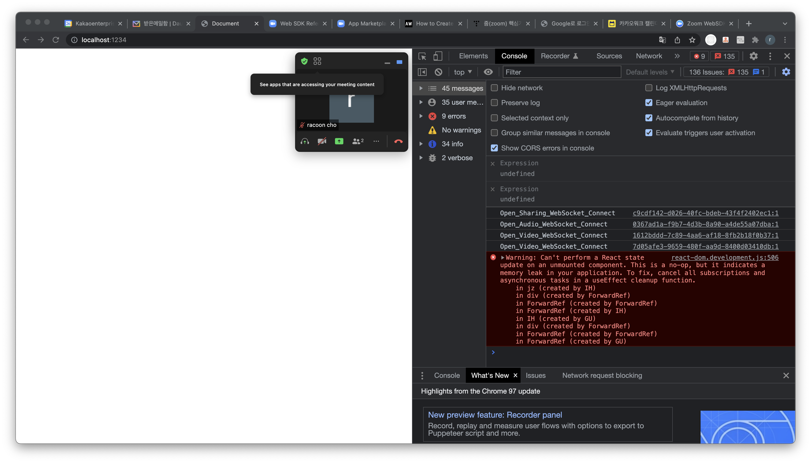
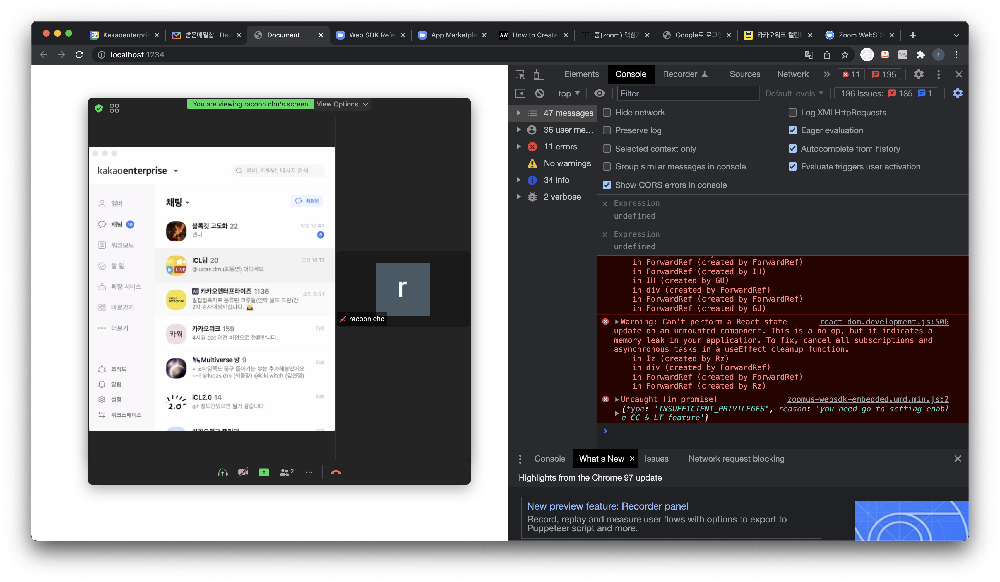
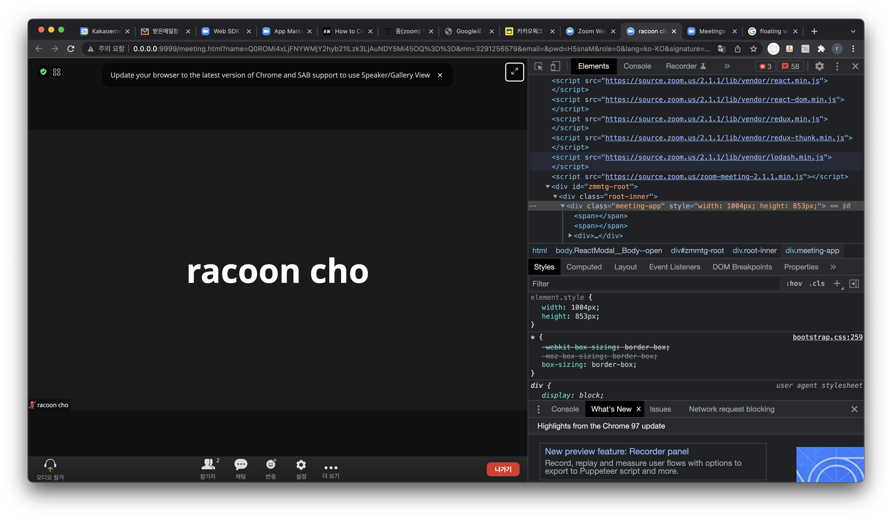

# zoom research

줌은 어떻게 제공하고 있고, 원리는 무엇인가

## 어떻게 제공하는가

- https://marketplace.zoom.us/docs/sdk/sdk-reference/web-reference

## 글 요약

- https://marketplace.zoom.us/docs/sdk/native-sdks/introduction
  - 줌 클라이언트 앱의 subset 기능을 제공
  - 장점 3가지
    - easy to use: 쉽게 구현할 수 있음
    - 현지화: 7개 주요 언어 기본 지원 + 번역 확장성
    - 맞춤형: 직접 통합할 수 있음
  - SDK 기능은 줌 클라이언트와 아예 똑같은건 아니다.
- https://marketplace.zoom.us/docs/sdk/native-sdks/web/build
  - 순서대로 진행해야함 (크레덴셜 얻기 -> sdk 설치하기)
    - JWT app type 으로 앱 생성
  - meeting sdk 설치방법 2가지
    - npm install
    - cdn
      - 사용방법이 2가지로 나뉨
      - 컴포넌트 뷰는 벤더 css 추가 필요
      - 컴포넌트 뷰는 embedded 붙은 js 추가
      - 클라이언트 뷰는 안붙은 js 추가
      - 두 뷰 모두 벤더 라이브러리는 각각 추가
- https://marketplace.zoom.us/docs/sdk/native-sdks/web/signature
  - 미팅이나 웨비나 참석을 위해선 암호화된 시그니처가 검증되어야한다. 시그니처는 JWT 크레덴셜이 안전하게 저장되어있는 서버에서 매번 생성되어야한다.
  - 대충 구현한건 [여기](./server.js)에
  - 서버로 부터 얻은 시그니처 값은 ZoomMtg.join 메서드에서 사용된다.

```js
ZoomMtg.join({
  signature: signature, // <- here
  meetingNumber: meetingNumber,
  userName: userName,
  apiKey: apiKey,
  userEmail: userEmail,
  passWord: password,
  success: (success) => {
    console.log(success);
  },
  error: (error) => {
    console.log(error);
  },
});
```

- https://marketplace.zoom.us/docs/sdk/native-sdks/web/component-view

  - 컴포넌트 뷰는 3가지 컴포넌트(갤러리 뷰, 스크린 공유, 리본 뷰)를 사용할 수 있음
  - floating widget으로 존재함
  - 
  - 
  - 끝나면 화면에서 사라짐
  - body에 1개 추가해두어야함.

  ```html
  <body>
    <div id="meetingSDKElement">
      <!-- Zoom Meeting SDK Rendered Here -->
    </div>
  </body>
  ```

- https://marketplace.zoom.us/docs/sdk/native-sdks/web/client-view
  - 풀 페이지로 사용할 수 있음
  - 줌 웹 클라이언트와 동일한 경험을 줄 수 있음
  - 
  - 개발방식 body에 2개를 추가해두어야함. iframe은 없음
  ```html
  <body>
    <div id="zmmtg-root"></div>
    <div id="aria-notify-area"></div>
  </body>
  ```

## meeting sdk 구성

### inside

- index.js // <- 클라이언트 뷰
- embedded.js // <- 컴포넌트 뷰
- dist
  - css
    - bootstrap.css
    - react-select.css
  - fonts
    - glyphicons
  - lib
    - audio (= 오디오 파일들)
    - av (= audio video 관련 스크립트)
    - image (= 이미지 파일들)
    - lang (= 다국어 json 파일들)
    - webim.min.js (= ?)
  - zoom-meeting-2.1.1.min.js
  - zoomus-websdk.umd.min.js
  - zoom-meeting-embedded-ES5.min.js
  - zoomus-websdk.embedded.umd.min.js

### 특이사항

- react, redux, redux-thunk 사용
- 라이브러리 버전이 고정되어 있음
  - 이미 쓰고있는 라이브러리가 버전 충돌된다면 이슈가 될 듯
- 빌드는 webpack 사용한 듯.
  - 개발할때도 webpack을 사용해야함.
- 기본 css는 js파일에 포함되어있음
- 사용하려면 webpack 사용해야함. es 모듈 환경에선 클라이언트뷰는 제대로 동작안함...
  - 가이드 문서가 친절하지 않음
  - 그래도 잘돌아가는 github 예제가 있음. (https://github.com/zoom/sample-app-web)
- 컴포넌트 뷰에선 커스텀 버튼을 추가할 수 있음.
- 클라이언트 뷰에선 초기화시(=init) 회의 종료시 리다이렉트 url을 넘겨줄 수 있음
